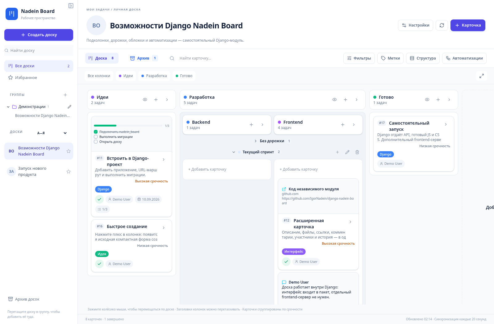
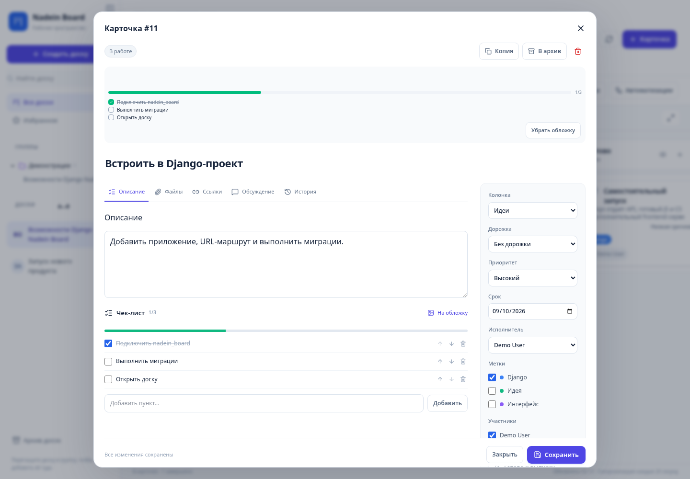
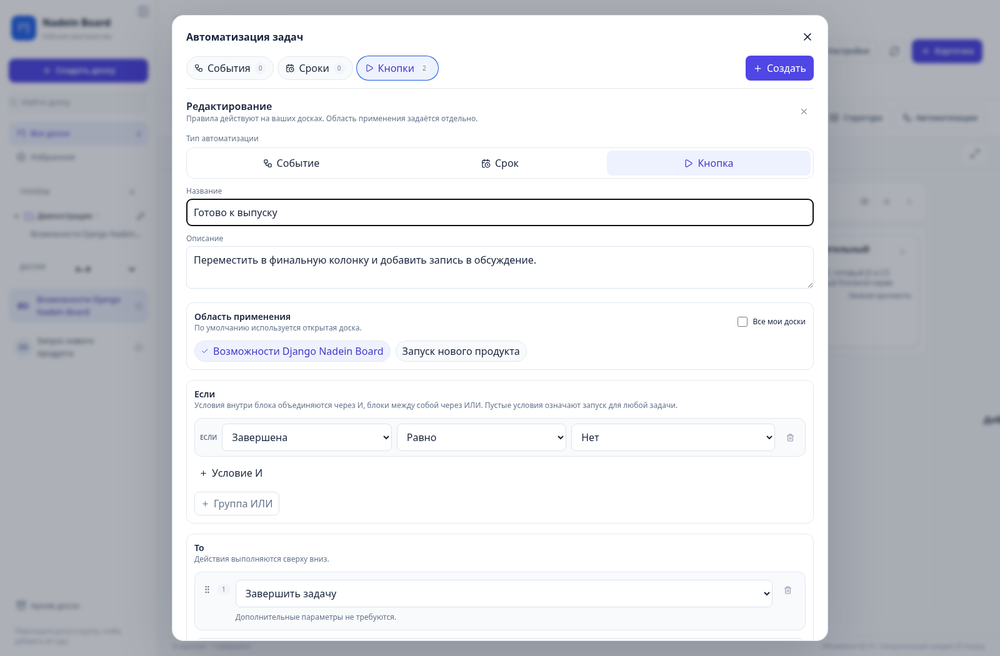

<p align="center"><a href="README.md">English</a> · <a href="README.ru.md">Русский</a> · <strong>Deutsch</strong> · <a href="README.es.md">Español</a></p>

# Django Nadein Board

**Aufgabenboards und automatisierte Abläufe in Django.**

[](https://github.com/IgorNadein/django-nadein-board/actions/workflows/checks.yml)


[](LICENSE)

[Oberfläche ansehen](docs/demo.md) · [Integration & API](docs/integration.md) · [Architektur](docs/architecture.md) · [Issues](https://github.com/IgorNadein/django-nadein-board/issues)

Ein eigenständiges Aufgabenboard-Paket für Django mit integrierter React-/TypeScript-Oberfläche. Erweitert bestehende Django-Anwendungen um gemeinsame Aufgabenverwaltung und automatisierte Arbeitsabläufe und nutzt dabei deren Benutzer und Anmeldung.



## Auf einen Blick

| Bereich | Funktionen |
|---|---|
| **Arbeit organisieren** | Spalten, Unterspalten, Bahnen, Prioritäten, Labels und Filter. |
| **Aufgaben bearbeiten** | Titelbilder, Checklisten, Kommentare, geschützte Anhänge und Verlauf. |
| **Abläufe automatisieren** | Ereignisregeln, manuelle Schaltflächen, Zeitregeln und Ausführungsprotokolle. |
| **Django weiterverwenden** | Bestehende Benutzer und Sitzungen; kompiliertes React-UI im Wheel. |

<details>
<summary>Weitere Ansichten</summary>





</details>

Persönliche Board-Gruppen und Favoriten, Filter, Archivierung/Wiederherstellung, ein erweiterter Karteneditor, Teilnehmer, Links, Verlauf und Kopien sind integriert. Der Automatisierungseditor und die Engine unterstützen Ereignisse, manuelle Schaltflächen und Zeitregeln mit Ausführungsprotokollen.

Zeitregeln benötigen einen regelmäßigen Aufruf von `python manage.py run_board_automations`. Die Oberfläche aktualisiert sich im Ruhezustand alle 20 Sekunden und pausiert beim Bearbeiten. Benachrichtigungen und WebSocket-Push lassen sich über die Host-Anwendung ergänzen.

## Demo

```bash
git clone https://github.com/IgorNadein/django-nadein-board.git
cd django-nadein-board
python -m venv .venv
source .venv/bin/activate
python -m pip install -e .
python manage.py migrate
python manage.py seed_board_demo
python manage.py seed_board_showcase
python manage.py runserver 127.0.0.1:8765
```

Demo: http://127.0.0.1:8765/board/ — `demo` / `demo-board-local`.

Die Benutzeroberfläche ist auf Russisch. Lizenziert unter der [MIT-Lizenz](LICENSE). Das Paket ist noch nicht auf PyPI veröffentlicht. 31 Backend-Tests und 6 Frontend-Tests sowie Builds und Migrationsprüfungen werden in GitHub Actions ausgeführt.

## Weiteres Paket

[Django Nadein Notifications](https://github.com/IgorNadein/django-nadein-notifications) — Beide Pakete funktionieren unabhängig. Die Host-Anwendung verbindet Board-Ereignisse bei Bedarf mit Benachrichtigungen.
